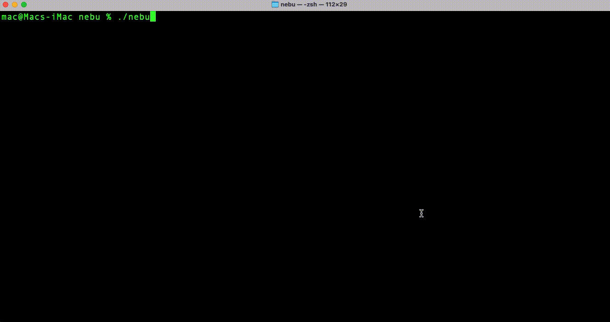
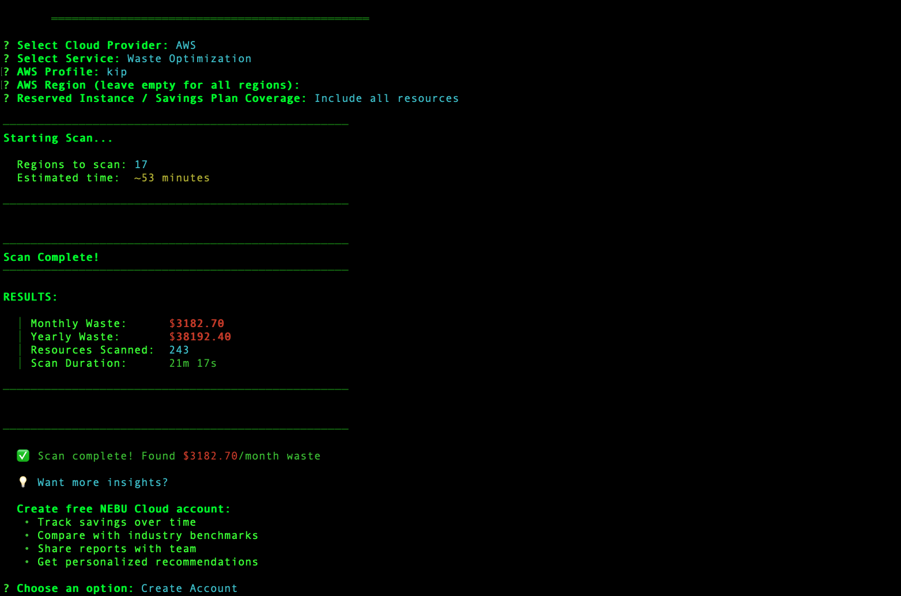

# NEBU SCAN

A powerful CLI tool for auditing AWS cloud infrastructure. Find cost savings, security issues, and optimization opportunities across your entire AWS account.

**Version:** 1.0.0

<p align="center">
  
</p>

## What is NEBU SCAN?

NEBU SCAN analyzes your AWS account and gives you actionable insights about:

- **Cost Waste** - Find underutilized resources, idle instances, and opportunities to save money
- **Security Issues** - Detect misconfigurations, public resources, and security vulnerabilities
- **Optimization** - Get recommendations for rightsizing, better configurations, and best practices

Currently supports **50+ AWS services** including EC2, RDS, S3, Lambda, ECS, DynamoDB, and more.

<p align="center">
  
</p>

## Installation

Download the binary for your operating system from the [releases page](https://github.com/THE-NEBU/NEBU-SCAN/releases).

### Linux
```bash
curl -L https://github.com/THE-NEBU/NEBU-SCAN/releases/latest/download/nebu-linux-amd64 -o nebu
chmod +x nebu
sudo mv nebu /usr/local/bin/
```

### macOS (Intel)
```bash
curl -L https://github.com/THE-NEBU/NEBU-SCAN/releases/latest/download/nebu-darwin-amd64 -o nebu
chmod +x nebu
sudo mv nebu /usr/local/bin/
```

### macOS (Apple Silicon - M1/M2/M3)
```bash
curl -L https://github.com/THE-NEBU/NEBU-SCAN/releases/latest/download/nebu-darwin-arm64 -o nebu
chmod +x nebu
sudo mv nebu /usr/local/bin/
```

### Windows

**Option 1: Quick Install (Recommended)**

1. Download `nebu-windows-amd64.exe` from the [releases page](https://github.com/THE-NEBU/NEBU-SCAN/releases)
2. Rename it to `nebu.exe`
3. Move it to `C:\Program Files\NEBU\`
4. Add to PATH:

**Using PowerShell (Run as Administrator):**
```powershell
# Create directory
New-Item -Path "C:\Program Files\NEBU" -ItemType Directory -Force

# Move the downloaded file
Move-Item -Path "$env:USERPROFILE\Downloads\nebu-windows-amd64.exe" -Destination "C:\Program Files\NEBU\nebu.exe"

# Add to PATH permanently
[Environment]::SetEnvironmentVariable("Path", $env:Path + ";C:\Program Files\NEBU", "Machine")

# Verify installation (open a new PowerShell window)
nebu --help
```

**Manual PATH Setup:**
1. Search for "Environment Variables" in Windows Start Menu
2. Click "Environment Variables"
3. Under "System Variables", find "Path" and click "Edit"
4. Click "New" and add: `C:\Program Files\NEBU`
5. Click "OK" on all windows
6. Open a new Command Prompt or PowerShell and type `nebu --help`

## Getting Started

### Prerequisites

You need AWS credentials configured on your machine. NEBU SCAN uses the same credentials as the AWS CLI.

```bash
# Make sure you have AWS CLI configured
aws configure

# Or use AWS SSO
aws sso login --profile your-profile
```

**Required IAM Permissions:** NEBU SCAN needs read-only access to your AWS resources. We recommend using the AWS managed policy `ReadOnlyAccess` or creating a custom policy with describe/list/get permissions.

### Your First Scan

**Option 1: Interactive Mode (Easiest)**

Just run `nebu` and it will guide you through the options:

```bash
nebu
```

This will ask you:
- Which cloud provider (AWS)
- What to scan (Waste or Security)
- AWS profile to use
- Region (leave empty for all regions)
- Whether to include resources covered by Reserved Instances/Savings Plans

**Option 2: Direct Commands**

```bash
# Scan for cost waste in all regions
nebu aws waste your-profile exclude

# Scan for waste in a specific region
nebu aws waste your-profile exclude us-east-1

# Run security audit on all regions
nebu aws security your-profile

# Run security audit on specific region
nebu aws security your-profile us-west-2
```

## How to Use

### Waste Optimization Scans

This scans your AWS resources and finds opportunities to save money.

**Basic syntax:**
```bash
nebu aws waste <aws-profile> <exclude|include> [region]
```

**Parameters:**
- `aws-profile`: The AWS profile name from your `~/.aws/credentials` file (e.g., "default", "production", "staging")
- `exclude|include`:
  - `exclude` - Only show resources NOT covered by Reserved Instances or Savings Plans (recommended)
  - `include` - Show all resources including those covered by RI/SP
- `region` (optional): AWS region to scan (e.g., "us-east-1"). Leave empty to scan all regions.

**Examples:**
```bash
# Scan production account, all regions, exclude RI/SP covered resources
nebu aws waste production exclude

# Scan only us-east-1
nebu aws waste production exclude us-east-1

# Include all resources (even RI/SP covered)
nebu aws waste production include
```

**What you'll get:**
- Total monthly waste amount
- List of optimization opportunities sorted by potential savings
- Each opportunity includes:
  - Resource ID and service
  - Current vs recommended configuration
  - Estimated monthly savings
  - Implementation complexity (how hard it is to fix)
  - Step-by-step remediation guide

### Security Audits

This scans for security vulnerabilities and misconfigurations.

**Basic syntax:**
```bash
nebu aws security <aws-profile> [region]
```

**Parameters:**
- `aws-profile`: The AWS profile name
- `region` (optional): AWS region to scan. Leave empty for all regions.

**Examples:**
```bash
# Scan all regions for security issues
nebu aws security production

# Scan only eu-west-1
nebu aws security production eu-west-1
```

**What you'll get:**
- Total number of security findings
- Findings categorized by severity (Critical, High, Medium, Low)
- Details for each finding including:
  - What the issue is
  - Why it's a problem
  - How to fix it
  - Affected resource

**Security checks include:**
- IAM: Overly permissive policies, MFA gaps, inactive credentials, admin users
- S3: Public buckets, unencrypted data, insecure bucket policies
- EC2: Public instances, security group misconfigurations, IMDSv2 not enforced
- RDS: Publicly accessible databases, unencrypted data, backup issues

## Command Reference

```bash
# Show help
nebu help
nebu --help

# Show version
nebu --version

# Interactive mode
nebu

# Waste scans
nebu aws waste <profile> exclude             # All regions, exclude RI/SP
nebu aws waste <profile> exclude <region>    # Single region, exclude RI/SP
nebu aws waste <profile> include             # All regions, include RI/SP
nebu aws waste <profile> include <region>    # Single region, include RI/SP

# Security scans
nebu aws security <profile>                  # All regions
nebu aws security <profile> <region>         # Single region

# Telemetry management
nebu telemetry status                         # Check if telemetry is enabled
nebu telemetry enable                         # Enable usage tracking
nebu telemetry disable                        # Disable usage tracking
```

## What AWS Services Are Supported?

### Waste Optimization (50+ Services)

**Compute:**
- EC2 - Rightsizing, stopped instances, underutilized instances
- ECS - Idle clusters, oversized tasks
- EKS - Underutilized node groups
- Lambda - Oversized functions, unused functions
- EMR - Idle clusters

**Storage:**
- EBS - Unattached volumes, over-provisioned volumes, old snapshots
- S3 - Storage class optimization, incomplete multipart uploads
- EFS - Underutilized file systems
- FSx - Idle file systems

**Database:**
- RDS - Oversized instances, stopped instances, idle databases
- DynamoDB - Over-provisioned throughput
- ElastiCache - Underutilized clusters
- Redshift - Idle clusters, oversized clusters
- DocumentDB - Underutilized clusters

**Networking:**
- NAT Gateway - Idle NAT gateways, data transfer optimization
- Load Balancers - Idle load balancers (ALB, NLB, Classic)
- VPC - Unused resources
- Transit Gateway - Underutilized attachments

**Data & Analytics:**
- Glue - Unused jobs and crawlers
- Kinesis - Over-provisioned streams

**AI/ML:**
- SageMaker - Idle notebook instances and endpoints

**Other:**
- Backup - Excessive backup retention
- CloudWatch - Log retention optimization
- KMS - Unused keys
- Route53 - Unused hosted zones
- SNS/SQS - Idle topics and queues

### Security Audit (4 Core Services)

**IAM** (15+ security checks)
- Users with admin access
- MFA not enabled
- Inactive credentials
- Overly permissive policies
- Password policy issues
- Root account usage

**S3** (10+ security checks)
- Public buckets
- Unencrypted buckets
- Versioning not enabled
- Access logging disabled
- Insecure bucket policies

**EC2** (8+ security checks)
- Public instances
- Security groups allowing 0.0.0.0/0
- IMDSv2 not enforced
- Public snapshots
- Unencrypted volumes

**RDS** (12+ security checks)
- Publicly accessible databases
- Unencrypted databases
- Automatic backups disabled
- Deletion protection disabled
- Multi-AZ not enabled

## Understanding the Output

### Waste Optimization Results

```
SUMMARY
  Total Monthly Waste:     $4,250.50
  Opportunities Found:     318
  Regions Scanned:         17
  Scan Duration:           8m45s

BY BUSINESS IMPACT
  ● CRITICAL:    25 opportunities → $1,850.25/month
  ● HIGH:        48 opportunities → $1,420.75/month
  ● MEDIUM:      156 opportunities → $820.50/month
  ● LOW:         89 opportunities → $159.00/month
```

The **Business Impact** tells you how easy/hard it is to implement:
- **CRITICAL** - Very easy, low risk (5-15 minutes)
- **HIGH** - Easy, some planning needed (30-60 minutes)
- **MEDIUM** - Moderate effort, testing required (2-4 hours)
- **LOW** - Significant effort, careful planning needed (1+ day)

### Security Audit Results

```
SUMMARY
  Regions Scanned:    17
  Total Findings:     672
  Scan Duration:      2m18s

FINDINGS BY SEVERITY
  ● CRITICAL:    59 findings
  ● HIGH:        126 findings
  ● MEDIUM:      336 findings
  ● LOW:         151 findings
```

**Severity Levels:**
- **CRITICAL** - Immediate security risk, fix ASAP
- **HIGH** - Significant risk, should fix soon
- **MEDIUM** - Moderate risk, plan to address
- **LOW** - Minor risk or best practice

## Privacy & Telemetry

NEBU SCAN collects anonymous usage data to help us improve the tool. This is **opt-in** and you can disable it anytime.

**What we collect:**
- Anonymous installation ID (random UUID)
- CLI version, operating system
- Scan duration and number of regions scanned
- Number of findings by severity level
- Total savings amount

**What we DON'T collect:**
- Your AWS account ID or any credentials
- Resource names, IDs, ARNs, or any identifiers
- IP addresses
- Any personal information

**To manage telemetry:**
```bash
nebu telemetry status    # See current status
nebu telemetry enable    # Enable
nebu telemetry disable   # Disable
```

## FAQ

**Q: Is it safe to use in production?**
A: Yes! NEBU SCAN only performs read-only operations. It never modifies your infrastructure.

**Q: How long does a scan take?**
A: Single region: 2-5 minutes. All regions: 8-15 minutes. Depends on how many resources you have.

**Q: Do I need special AWS permissions?**
A: You need read-only access. Use the AWS managed policy `ReadOnlyAccess` or equivalent describe/list/get permissions.

**Q: Can I scan multiple AWS accounts?**
A: Yes! Just configure multiple profiles in `~/.aws/credentials` and run NEBU SCAN for each profile.

**Q: What's the difference between "exclude" and "include" for waste scans?**
A: "exclude" only shows resources you're actually paying for (not covered by Reserved Instances or Savings Plans). This gives you actionable opportunities. "include" shows everything, even resources already optimized with RI/SP.

**Q: How accurate are the savings estimates?**
A: Very accurate. We use actual AWS pricing APIs and CloudWatch metrics. Estimates are conservative (we'd rather underestimate than overestimate).

**Q: Does NEBU SCAN work with AWS Organizations?**
A: You need to run it separately for each account. Configure different AWS profiles for each account.

**Q: Can I export the results?**
A: The CLI shows results in your terminal. For detailed reports and historical tracking, create a free account at [report.thenebu.com](https://report.thenebu.com).

## NEBU Cloud (Optional)

Want more features? Create a free account at [report.thenebu.com/register](https://report.thenebu.com/register).

You get:
- Historical tracking of savings and security posture
- Share reports with your team
- Compliance reports (SOC2, HIPAA, PCI-DSS)
- Detailed remediation guides
- Benchmarking against similar companies

## Troubleshooting

**Error: "Unable to locate credentials"**
- Make sure you've run `aws configure` or have AWS credentials set up
- Check that your profile name is correct

**Error: "Access Denied"**
- Your AWS user/role needs read-only permissions
- Add the `ReadOnlyAccess` policy to your IAM user/role

**Scan is very slow**
- This is normal if you have lots of resources
- You can scan a single region first to see results faster

**No opportunities found**
- Great! Your infrastructure is well-optimized
- Try running a security audit instead

## Roadmap

- [x] AWS cost waste optimization
- [x] AWS security audits
- [ ] GCP support
- [ ] Azure support
- [ ] Compliance checking (CIS, SOC2, HIPAA)
- [ ] Automated remediation
- [ ] Cost forecasting

## Support

Need help? Reach out:
- Email: support@thenebu.com
- Website: https://thenebu.com
- GitHub Issues: https://github.com/THE-NEBU/NEBU-SCAN/issues

## License

Proprietary software. All rights reserved.

This is closed-source software provided as compiled binaries only. You may not redistribute, modify, reverse engineer, or create derivative works.

Copyright © 2025 NEBU

---

Made with ❤️ by the NEBU team
